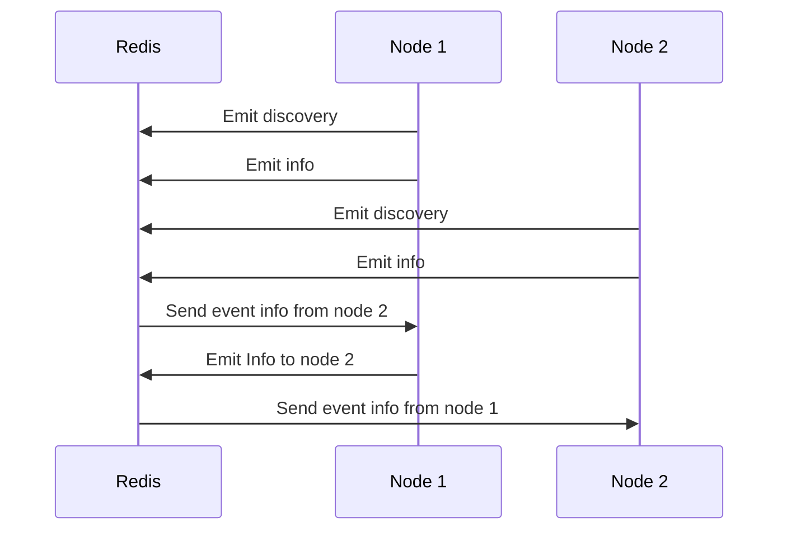
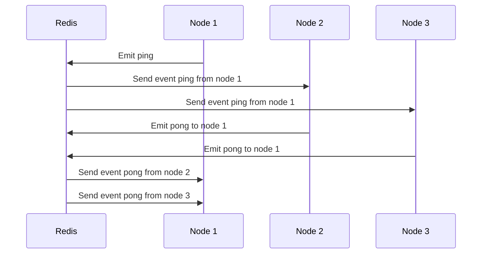
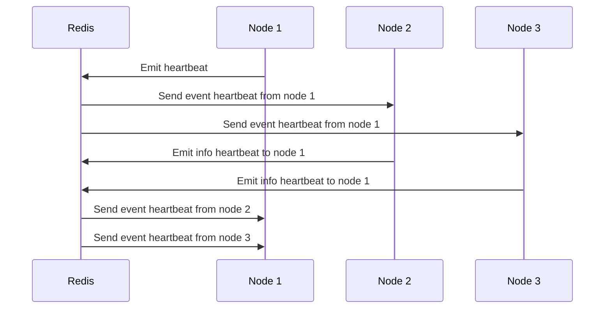

# Discovery and info

```mermaid
sequenceDiagram
    participant R as Redis
    participant N1 as Node 1
    participant N2 as Node 2

    N1->>R: Emit discovery
    N1->>R: Emit info
    N2->>R: Emit discovery
    N2->>R: Emit info
    R->>N1: Send event info from node 2
    N1->>R: Emit Info to node 2
    R->>N2: Send event info from node 1

```
# Ping pong

```mermaid
sequenceDiagram
    participant R as Redis
    participant N1 as Node 1
    participant N2 as Node 2
    participant N3 as Node 3

    N1->>R: Emit ping
    R->>N2: Send event ping from node 1
    R->>N3: Send event ping from node 1
    N2->>R: Emit pong to node 1
    N3->>R: Emit pong to node 1
    R->>N1: Send event pong from node 2
    R->>N1: Send event pong from node 3

```
# Heartbeat

```mermaid
sequenceDiagram
    participant R as Redis
    participant N1 as Node 1
    participant N2 as Node 2
    participant N3 as Node 3

    N1->>R: Emit heartbeat
    R->>N2: Send event heartbeat from node 1
    R->>N3: Send event heartbeat from node 1
    N2->>R: Emit info heartbeat to node 1
    N3->>R: Emit info heartbeat to node 1
    R->>N1: Send event heartbeat from node 2
    R->>N1: Send event heartbeat from node 3

```